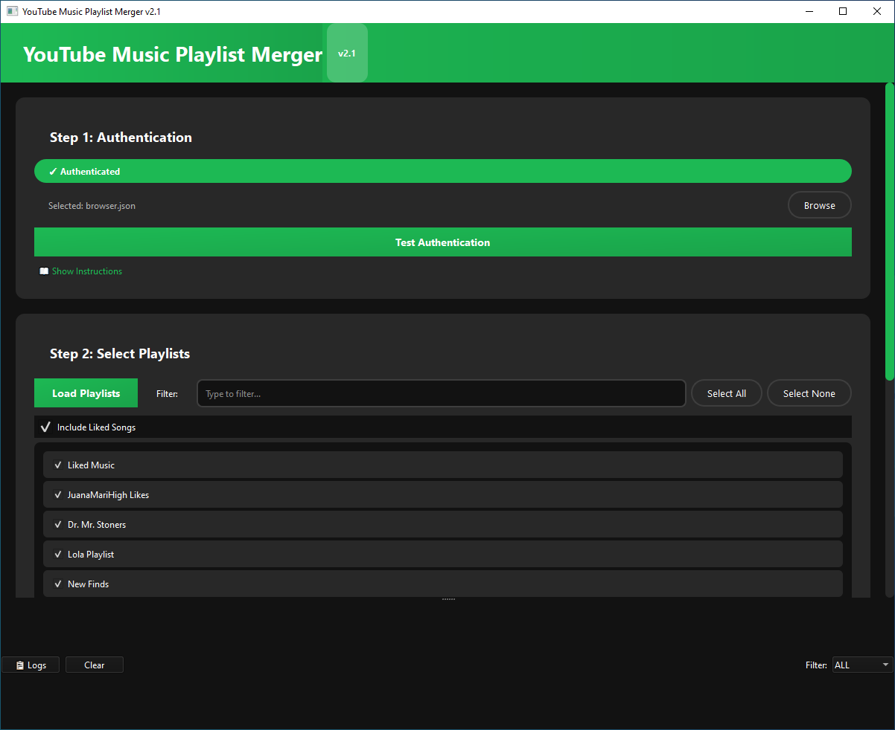
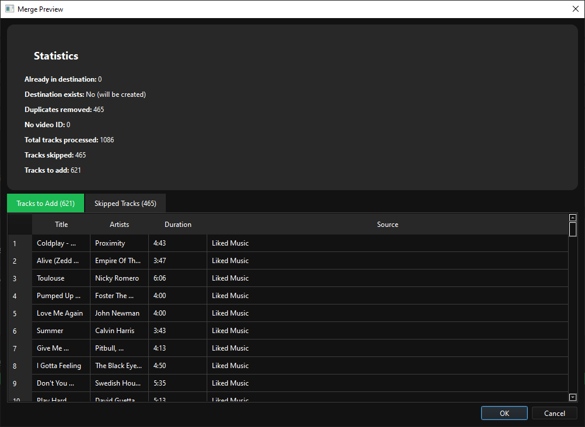

# YouTube Music Playlist Merger 🎵

A modern, user-friendly desktop application for merging multiple YouTube Music playlists into one. Built with Python and PySide6, featuring a sleek dark theme interface.


## ✨ Features

- **🔀 Merge Multiple Playlists**: Combine any number of YouTube Music playlists into a single playlist
- **❤️ Include Liked Songs**: Option to include your liked songs in the merge
- **🔍 Smart Duplicate Detection**: Automatically removes duplicate tracks across playlists
- **👁️ Preview Before Publishing**: See exactly what will be added or skipped before making changes
- **🎨 Modern Dark Theme**: Easy on the eyes with a professional Spotify-inspired interface
- **📊 Detailed Statistics**: View comprehensive stats about your merge operation
- **🔐 Privacy Control**: Choose between Private, Unlisted, or Public for your merged playlist
- **📝 Advanced Logging**: Built-in log viewer for debugging and tracking operations
- **💾 Settings Persistence**: Remembers your preferences between sessions

## 📸 Screenshots


*Main application interface*


*Preview dialog showing merge statistics*

## 🚀 Quick Start

### Prerequisites

- Python 3.8 or higher
- YouTube Music account
- Firefox browser (for authentication setup)

### Installation

1. **Clone the repository**
   ```bash
   git clone https://github.com/Aanzil/youtube-music-playlist-merger.git
   cd youtube-music-playlist-merger
   ```

2. **Install dependencies**
   ```bash
   pip install -r requirements.txt
   ```

3. **Run the application**
   ```bash
   python youtube_music_merger.py
   ```

## 🔐 Authentication Setup

YouTube Music requires authentication to access your playlists. Follow these steps:

1. **Open YouTube Music** in Firefox and log in to your account
2. **Open Developer Tools** (F12) → Network tab
3. **Disable cache** (checkbox in Network tab)
4. **Click Library** in YouTube Music, then reload the page
5. **Filter by XHR** and search for ```/browse```
6. **Click on** ```browse?prettyPrint=false``` request
7. **Go to Request Headers** → Switch to **Raw** view
8. **Copy all** the raw headers text
9. **In terminal**, run:
   ```bash
   ytmusicapi browser
   ```
10. **Paste** the headers and press Enter
11. **Press Ctrl+Z** (Windows) or **Ctrl+D** (macOS/Linux) then Enter
12. **Select the generated** ```browser.json``` file in the application

For detailed instructions with screenshots, see [Authentication Guide](docs/AUTHENTICATION.md).

## 📖 How to Use

### Step 1: Authenticate
- Click "Browse" to select your ```browser.json``` file
- Click "Test Authentication" to verify connection

### Step 2: Select Playlists
- Click "Load Playlists" to fetch your YouTube Music library
- Select playlists you want to merge using checkboxes
- Optionally include your Liked Songs
- Set destination playlist name and privacy level

### Step 3: Preview & Publish
- Click "Preview Changes" to see what will be merged
- Review statistics and track lists
- Click "Publish Playlist" to create/update the merged playlist

## 🛠️ Technical Details
### Built With
- **Python 3.8+** - Core language
- **PySide6** - Qt-based GUI framework
- **ytmusicapi** - YouTube Music API wrapper
- **Qt Dark Theme** - Modern UI styling

## Key Features Implementation
- **Async Operations**: Background threads prevent UI freezing
- **Caching System**: Reduces API calls for better performance
- **Smart Deduplication**: Compares video IDs to prevent duplicates
- **Batch Processing**: Adds tracks in batches of 50 for efficiency
- **Error Handling**: Comprehensive error catching and logging

## 🤝 Contributing
Contributions are welcome! Please feel free to submit a Pull Request.

1. Fork the repository
2. Create your feature branch (```git checkout -b feature/AmazingFeature```)
3. Commit your changes (```git commit -m 'Add some AmazingFeature'```)
4. Push to the branch (```git push origin feature/AmazingFeature```)
5. Open a Pull Request

## 📝 License
This project is licensed under the MIT License - see the LICENSE file for details.

## 🙏 Acknowledgments
- **ytmusicapi** for the YouTube Music API wrapper
- **PySide6** for the GUI framework
- Inspired by the need for better playlist management in YouTube Music

## ⚠️ Disclaimer
This tool is for personal use only. Please respect YouTube's Terms of Service and use responsibly. The authors are not responsible for any misuse of this application.

## 🌟 Show your support
Give a ⭐️ if this project helped you!